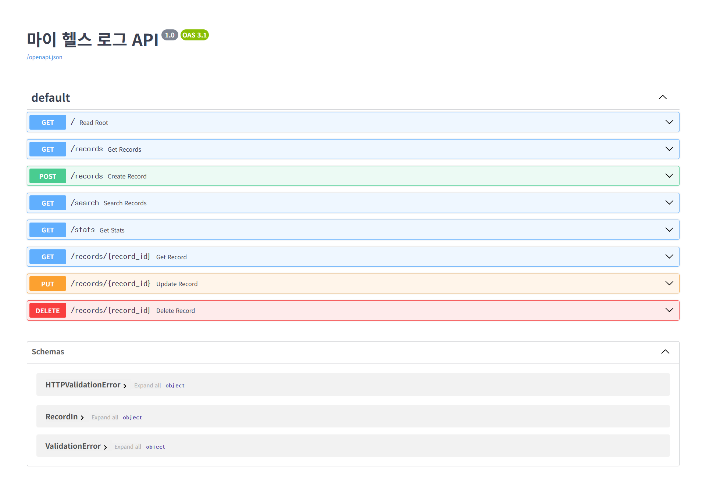

# 🩺 마이 헬스 로그 (My Health Log) API

> **개인 맞춤형 건강 기록 관리 및 분석 RESTful API 서버**  
> 일별 신체 데이터(몸무게, 키, 혈압, 혈당 등)를 기록하고, 자동 BMI 계산 및 주요 건강 위험군 경고 알림을 제공하는 백엔드 서비스입니다.

---

## 📌 1. 프로젝트 주제 및 주요 기능

### 🎯 프로젝트 개요
**마이 헬스 로그(My Health Log)** 서비스는 사용자의 일상 건강 수치를 체계적으로 관리하고, 건강 위험 요소를 실시간으로 감지하여 안전한 건강 관리를 돕는 RESTful API 서버 프로젝트입니다.

### 💡 주요 기능 명세
- **건강 데이터 CRUD 기록**: 몸무게, 키, 수축기/이완기 혈압, 공복 혈당, 걸음 수, 수면 시간 기록
- **자동 건강 지표 계산**:
  - **BMI (체질량지수)** 자동 산출 및 비만도 단계 구분 (저체중/정상/과체중/비만)
  - **혈압 단계 분석**: 수축기 및 이완기 혈압 기반 단계 분류 (정상/주의/고혈압)
  - **혈당 상태 분석**: 공복 혈당 기준 위험군 분류 (정상/공복혈당장애/당뇨 의심)
- **위험 경고 알림 시스템**: 측정된 수치가 정상 범위를 벗어날 경우 위험 메시지 자동 생성
- **통계 및 조회 서비스**: 날짜별 기록 검색, 기간별 건강 추이 데이터 제공

---

## 🌐 2. AWS 배포 서버 주소

AWS Lightsail 환경에서 Docker 컨테이너 기반으로 배포되어 운영 중입니다.

- 🔗 **Swagger API Interactive Docs**: [http://43.202.42.45:8000/docs](http://43.202.42.45:8000/docs)
- 🔗 **Redoc API Documentation**: [http://43.202.42.45:8000/redoc](http://43.202.42.45:8000/redoc)

---

## 📸 3. 서비스 실행 및 시스템 캡처

### 🖥️ Swagger API Docs 접속 화면


### 🗄️ ERD 데이터베이스 구조 다이어그램


---

## 🛠️ 4. 기술 스택 (Tech Stack)

| 구분 | 기술 스택 |
|---|---|
| **Framework** | FastAPI (Python 3.10) |
| **Data Validation** | Pydantic v2 |
| **Server / Deployment** | Uvicorn, Docker, AWS Lightsail |
| **Version Control** | Git, GitHub |
| **Documentation** | ERD Cloud, Swagger UI |

---

## 🚀 5. 로컬 실행 방법

```bash
# 1. 저장소 클론
git clone [https://github.com/lofim8557-star/my-health-log.git](https://github.com/lofim8557-star/my-health-log.git)
cd my-health-log

# 2. 가상환경 생성 및 패키지 설치
python -m venv venv
source venv/bin/activate  # Windows: venv\Scripts\activate
pip install -r requirements.txt

# 3. 서버 실행
uvicorn main:app --reload --port 8000
```

